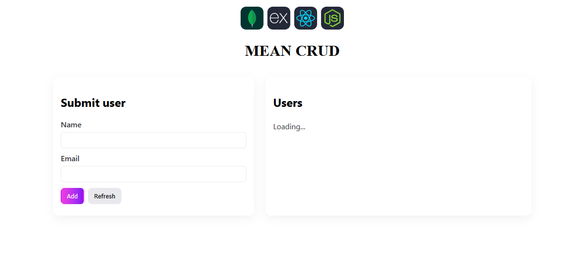

# Dockerize MEAN stack CRUD App

This project is a simple CRUD application built using the MEAN stack (MongoDB, Express, Angular, Node.js) and containerized with Docker. It demonstrates how to set up a full-stack application with a backend API and a frontend interface.

## Prerequisites

- Docker and Docker Compose installed on your machine.
- Node.js and npm installed for local development.
- MongoDB instance (can be run in a Docker container).
- Basic knowledge of Docker, Node.js, and React.
- Familiarity with Vite for frontend development.
- Basic understanding of Angular framework.
- Basic understanding of Express.js framework.
- Basic understanding of MongoDB database.

  
## Project Structure
```
.
├── backend
│   ├── Dockerfile
│   ├── package.json
│   ├── package-lock.json
│   └── src
│       └── server.js
├── docker-compose.yml
├── frontend
│   ├── angular.json
│   ├── Dockerfile
│   ├── nginx
│   │   └── default.conf
│   ├── package.json
│   ├── package-lock.json
│   ├── public
│   │   └── favicon.ico
│   ├── src
│   │   ├── app
│   │   │   ├── app.config.ts
│   │   │   ├── app.css
│   │   │   ├── app.html
│   │   │   ├── app.js
│   │   │   ├── app.routes.ts
│   │   │   ├── app.spec.ts
│   │   │   └── app.ts
│   │   ├── index.html
│   │   ├── main.ts
│   │   └── styles.css
│   ├── tsconfig.app.json
│   ├── tsconfig.json
│   └── tsconfig.spec.json
└── README.md
```

## Technologies Used


- **Backend**: Node.js, Express.js, MongoDB, Mongoose
- **Frontend**: Angular, Vite
- **Reverse Proxy**: Nginx
- **Containerization**: Docker, Docker Compose
- **Others**: npm for package management

## Output Screenshots



## Getting Started

1. Clone the repository:

```bash
git clone <repository-url>       
cd mern-crud-docker
```
2. Build and run the application using Docker Compose:
```bash
docker compose up --build -d
```
4. Access the application:
   - Frontend: `http://localhost:3000`
   - Backend API: `http://localhost:5000/api/items`

5. Stop the application:

```bash
docker compose down
```
